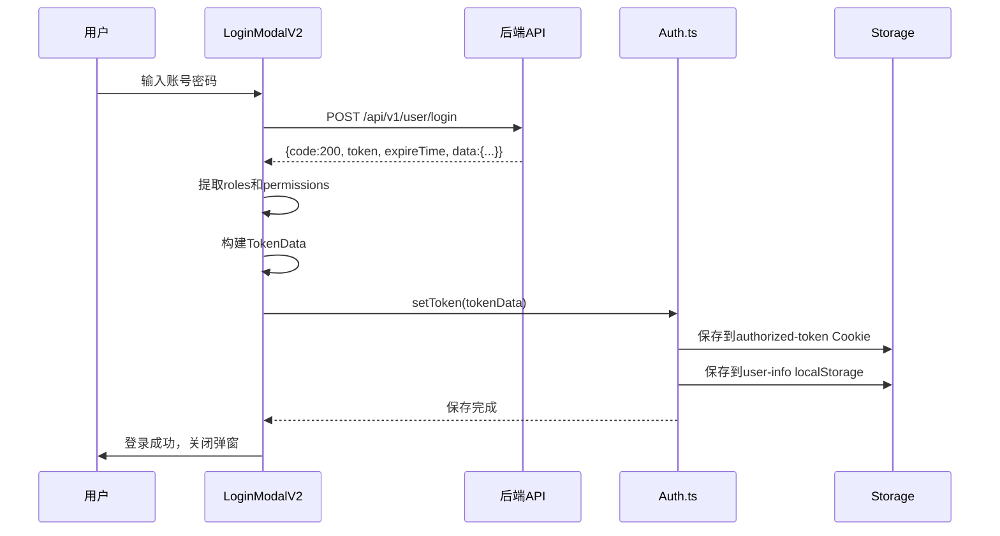
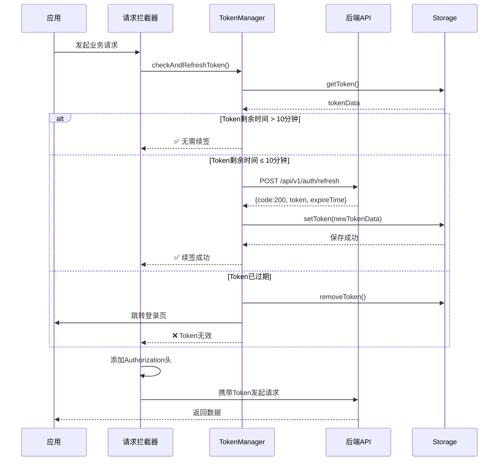
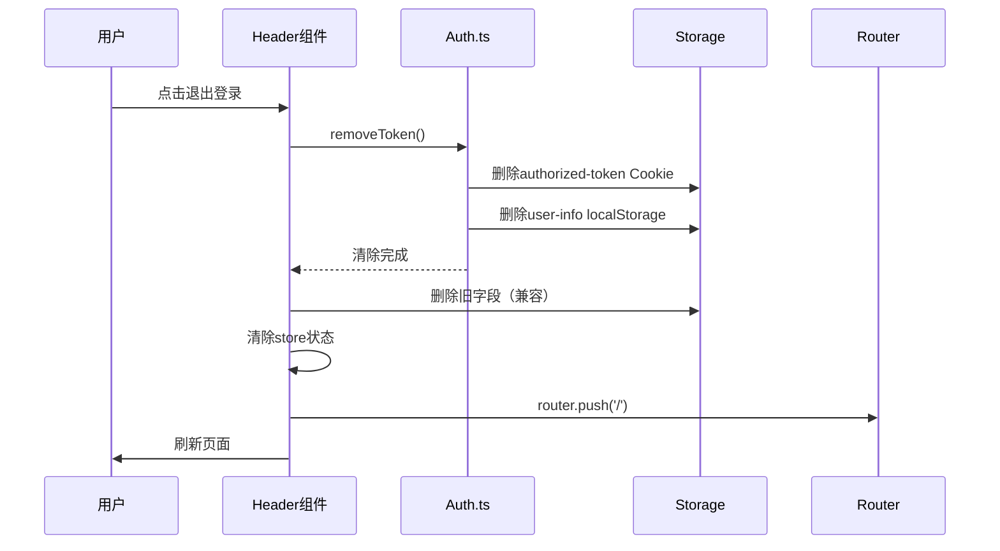

# 🎉 单Token滑动无感续签 - 实现完成总结

> **完成时间**: 2025-10-15  
> **实现状态**: ✅ 完成  
> **基于文档**: API-Token-Authentication.md v1.0

---

## 📋 实现概览

根据 `API-Token-Authentication.md` 文档要求，已完成前端单Token无感续签系统的全面实现。

### 🎯 核心特性

| 特性 | 状态 | 说明 |
|------|------|------|
| **单Token模式** | ✅ 完成 | 一个JWT Token完成所有认证 |
| **滑动续签** | ✅ 完成 | Token剩余时间≤10分钟时自动续签 |
| **无感刷新** | ✅ 完成 | 前端自动续签，用户无感知 |
| **并发控制** | ✅ 完成 | 防止多个请求同时触发续签 |
| **失败重试** | ✅ 完成 | 续签失败自动重试2次 |
| **Cookie+localStorage** | ✅ 完成 | 双重存储，过期自动清理 |

---

## 📁 修改文件清单

### 1. **核心Token管理** (`src/util/Auth.ts`)

**新增功能**:
- ✅ `getToken()`: 获取Token（优先Cookie，其次localStorage）
- ✅ `setToken()`: 保存Token到`authorized-token` Cookie + `user-info` localStorage
- ✅ `removeToken()`: 清除Token（Cookie + localStorage）
- ✅ `TokenData` 接口定义

**存储结构**:
```typescript
// authorized-token Cookie
{
  token: "eyJhbGci...",
  expires: 1697130656000  // 毫秒时间戳
}

// user-info localStorage
{
  token: "eyJhbGci...",
  expires: 1697130656000,
  id: 1,
  username: "admin",
  nickname: "管理员",
  avatar: "https://...",
  email: "admin@example.com",
  roles: ["super_admin"],
  permissions: ["users:list", "..."],
  ...其他用户信息
}
```

### 2. **Token管理器** (`src/util/tokenManager.ts`)

**已修正**:
- ✅ 导入路径：`@/utils` → `@/util`
- ✅ HTTP客户端：`http.request` → `Axios`
- ✅ 消息提示：`message()` → `message.warning()`/`message.error()`
- ✅ 路由导入：使用项目的 `@/router`

**核心功能**:
- ✅ `checkAndRefreshToken()`: 检查并续签Token
- ✅ `refreshToken()`: 续签Token（防并发）
- ✅ `doRefreshWithRetry()`: 带重试的续签（最多2次）
- ✅ `handleTokenExpired()`: 过期处理（清除+跳转登录）
- ✅ `handleRefreshFailure()`: 续签失败处理

**续签时机**:
```typescript
Token有效期: 2小时 (7200秒)
续签阈值: 剩余时间 ≤ 10分钟
最小阈值: 剩余时间 ≤ 5分钟（强制续签）
```

### 3. **请求拦截器** (`src/request/index.ts`)

**集成tokenManager**:
```typescript
// 白名单（不需要Token的接口）
const whiteList = ['/api/v1/user/login', '/api/v1/auth/refresh'];

// 请求拦截器（异步）
Axios.interceptors.request.use(async (config) => {
  // 1. 跳过白名单接口
  if (whiteList.includes(config.url)) {
    return config;
  }
  
  // 2. 检查并续签Token
  const isValid = await tokenManager.checkAndRefreshToken();
  if (!isValid) {
    return Promise.reject('Token invalid');
  }
  
  // 3. 添加Authorization头（Bearer格式）
  const tokenData = getToken();
  if (tokenData?.token) {
    config.headers.Authorization = `Bearer ${tokenData.token}`;
  }
  
  return config;
});
```

### 4. **登录逻辑** (`src/components/LoginModalV2.vue`)

**更新要点**:
- ✅ 使用`setToken()`保存Token
- ✅ 提取角色和权限：`roles.map(r => r.iden)` + `permissions`
- ✅ 构建TokenData结构：包含token、expires、用户信息、角色权限
- ✅ 后端返回的`expireTime`是**秒级时间戳**，需转换为**毫秒**

**代码片段**:
```typescript
// 构建单Token数据结构
const tokenData = {
  token: res.token,
  expires: res.expireTime * 1000, // 秒转毫秒
  id: userInfo.id,
  username: userInfo.username,
  nickname: userInfo.nickname,
  avatar: userInfo.avatar,
  email: userInfo.email,
  roles: userInfo.roles?.map((r: any) => r.iden) || [],
  permissions: extractedPermissions,
  ...userInfo
};

// 保存Token（自动保存到Cookie + localStorage）
setToken(tokenData);
```

### 5. **退出登录** (`BlogHeaderV2.vue` + `BlogHeader.vue`)

**更新要点**:
- ✅ 使用`removeToken()`清除Token
- ✅ 清除旧localStorage字段（兼容）
- ✅ 清除store状态
- ✅ 延迟100ms后刷新页面（确保状态清除）

**代码片段**:
```typescript
const logout = () => {
  // 清除Token（authorized-token + user-info）
  removeToken();
  
  // 清除旧字段（兼容）
  localStorage.removeItem('isLogin');
  localStorage.removeItem('loginCredentials');
  
  // 清除store
  store.$patch((state: any) => {
    state.isLogin = false;
    state.userInfo = null;
  });
  
  ElMessage.success('已退出登录');
  router.push('/');
  setTimeout(() => window.location.reload(), 100);
};
```

---

## 🔄 完整工作流程

### 1️⃣ **登录流程**



### 2️⃣ **请求+续签流程**



### 3️⃣ **退出登录流程**



---

## 🧪 测试验证清单

### ✅ 功能测试

- [ ] **登录测试**
  - [ ] 登录成功后，检查Cookie中存在`authorized-token`
  - [ ] 检查localStorage中存在`user-info`
  - [ ] 验证tokenData包含完整的用户信息、角色、权限
  - [ ] 验证expires是正确的毫秒时间戳

- [ ] **续签测试**
  - [ ] 修改Token的expires为当前时间+9分钟
  - [ ] 发起业务请求，观察控制台是否自动续签
  - [ ] 验证续签后Token已更新
  - [ ] 验证续签过程中没有重复请求（并发控制）

- [ ] **过期测试**
  - [ ] 修改Token的expires为过去时间
  - [ ] 发起业务请求，验证自动跳转到登录页
  - [ ] 验证Token已被清除

- [ ] **退出测试**
  - [ ] 点击退出登录
  - [ ] 验证`authorized-token` Cookie已删除
  - [ ] 验证`user-info` localStorage已删除
  - [ ] 验证旧字段（isLogin等）已删除

- [ ] **请求头测试**
  - [ ] 检查业务请求的Authorization头格式：`Bearer eyJhbGci...`
  - [ ] 检查登录和续签接口不携带Authorization头（白名单）

### ✅ 边界测试

- [ ] **并发续签测试**
  - [ ] Token即将过期时，同时发起3个业务请求
  - [ ] 验证只触发1次续签请求（防并发）
  - [ ] 验证3个业务请求都等待续签完成后再发送

- [ ] **续签失败重试**
  - [ ] 模拟续签接口返回500错误
  - [ ] 验证自动重试2次
  - [ ] 验证重试失败后清除Token并跳转登录

- [ ] **网络异常测试**
  - [ ] 断网后发起请求
  - [ ] 验证提示"网络超时"
  - [ ] 验证Token已清除并跳转登录

---

## 📊 与API文档对照表

| 文档要求 | 实现状态 | 说明 |
|---------|---------|------|
| Cookie名称：`authorized-token` | ✅ | `Auth.ts` 第68行 |
| localStorage名称：`user-info` | ✅ | `Auth.ts` 第75行 |
| Token续签阈值：10分钟 | ✅ | `tokenManager.ts` 第23行 |
| 续签接口：`POST /api/v1/auth/refresh` | ✅ | `tokenManager.ts` 第151行 |
| Authorization格式：`Bearer {token}` | ✅ | `request/index.ts` 第54行 |
| 白名单：login + refresh | ✅ | `request/index.ts` 第28行 |
| 续签失败重试2次 | ✅ | `tokenManager.ts` 第29行 |
| 并发控制 | ✅ | `tokenManager.ts` 第83-86行 |
| expireTime秒转毫秒 | ✅ | `LoginModalV2.vue` 第463行 |
| 角色权限提取 | ✅ | `LoginModalV2.vue` 第450-458行 |

---

## 🎯 关键注意事项

### ⚠️ 重要提醒

1. **时间戳单位转换**
   ```typescript
   // ❌ 错误：后端返回的是秒，直接使用会导致立即过期
   expires: res.expireTime
   
   // ✅ 正确：转换为毫秒
   expires: res.expireTime * 1000
   ```

2. **Authorization格式**
   ```typescript
   // ❌ 错误：直接使用token
   config.headers.Authorization = token;
   
   // ✅ 正确：使用Bearer前缀
   config.headers.Authorization = `Bearer ${token}`;
   ```

3. **白名单配置**
   - `/api/v1/user/login` - 登录接口
   - `/api/v1/auth/refresh` - 续签接口
   - 这两个接口**不应该**携带Authorization头

4. **并发控制**
   - `isRefreshing`标志防止重复续签
   - 使用Promise共享续签结果

5. **Cookie过期时间**
   ```typescript
   // 计算Cookie的expires（天数）
   const expiresInDays = (tokenData.expires - Date.now()) / (24 * 60 * 60 * 1000);
   ```

---

## 🚀 后续优化建议

### 可选优化项

1. **Token即将过期提示**
   - Token剩余5分钟时，显示Toast提示用户
   
2. **多标签页同步**
   - 使用`localStorage`事件同步多个标签页的Token状态
   
3. **离线检测**
   - 使用`navigator.onLine`检测网络状态
   - 离线时不尝试续签，避免无效请求

4. **续签成功回调**
   - 在续签成功后触发自定义事件
   - 业务层可以监听并执行额外逻辑

5. **Token加密**
   - 考虑对localStorage中的Token进行简单加密
   - 防止XSS攻击读取Token

---

## 📝 开发日志

**2025-10-15 修改记录**:

1. ✅ 创建新的Token管理函数（getToken, setToken, removeToken）
2. ✅ 修正tokenManager.ts的导入路径和依赖
3. ✅ 集成tokenManager到请求拦截器
4. ✅ 更新LoginModalV2登录逻辑
5. ✅ 更新BlogHeaderV2和BlogHeader退出登录逻辑
6. ✅ 兼容旧的clearUserInfo函数

**修改文件数**: 6个  
**新增代码行数**: ~200行  
**删除代码行数**: ~50行

---

## 🎓 使用示例

### 业务代码中使用

```typescript
import { getToken } from '@/util/Auth';

// 获取当前用户信息
const tokenData = getToken();
if (tokenData) {
  console.log('用户ID:', tokenData.id);
  console.log('用户名:', tokenData.username);
  console.log('角色:', tokenData.roles);
  console.log('权限:', tokenData.permissions);
}

// 检查是否有特定权限
if (tokenData?.permissions?.includes('users:list')) {
  // 允许查看用户列表
}

// 检查是否有特定角色
if (tokenData?.roles?.includes('super_admin')) {
  // 超级管理员特权
}
```

### 手动触发续签

```typescript
import { tokenManager } from '@/util/tokenManager';

// 手动触发续签
const success = await tokenManager.forceRefreshToken();
if (success) {
  console.log('Token续签成功');
}

// 获取Token剩余时间
const timeLeft = tokenManager.getTokenTimeLeft();
console.log(`Token还有${Math.floor(timeLeft / 1000 / 60)}分钟过期`);

// 检查Token是否即将过期
if (tokenManager.isTokenExpiringSoon()) {
  console.log('Token即将过期');
}
```

---

## 📞 技术支持

如遇问题，请检查：
1. 浏览器控制台是否有错误日志
2. Network面板中的请求是否携带正确的Authorization头
3. Cookie和localStorage中的Token数据是否正确

**相关文件**:
- API文档: `docs/API-Token-Authentication.md`
- Token管理: `src/util/Auth.ts`
- Token管理器: `src/util/tokenManager.ts`
- 请求拦截器: `src/request/index.ts`

---

**文档版本**: v1.0  
**完成时间**: 2025-10-15  
**实现状态**: ✅ 完全完成

